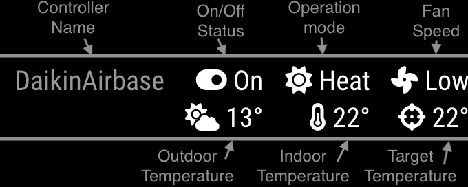

# MMM-DaikinAirbase

A module for [MagicMirror²](https://github.com/MagicMirrorOrg/MagicMirror/) designed to pull data from a Daikin AirBase wifi controller and display it on the mirror. As far as I can tell this device is only in the Australian/New Zealand market so this module would only be relevant to users there. Essentially if you use the Daikin Airbase app on your phone to access your air conditioner then this module should work with it.



## Installation

Navigate into your MagicMirror's `modules` folder and execute `git clone https://github.com/matt-thurling/MMM-DaikinAirbase`

## Using the module

To use this module, add the following configuration block to the modules array in the `config/config.js` file:

```js
let config = {
  modules: [
    {
      module: 'MMM-DaikinAirbase',
      position: 'top_right',
      config: {
          ipAddress: '10.1.1.99', // replace with the ip address of your airbase
     }
    },
  ],
};

```

## Configuration options

| Option           | Description                                                                                                               |
| ---------------- | ------------------------------------------------------------------------------------------------------------------------- |
| `ipAddress`      | _Required_ Local IP address of the Daikin Device.                                                                         |
| `updateInterval` | _Optional_ How often the content will be fetched. <br><br>**Type:** `int`(milliseconds) <br>Default 30000 (1/2 minute)    |
| `animationSpeed` | _Optional_ Speed of the update animation. <br><br>**Type:** `int`(milliseconds) <br>Default 1000 milliseconds (1 second)  |

## Attribution

This module was originally forked from the [MMM-Daikin](https://github.com/kymeyer/MMM-daikin/) module built by Kyrill Meyer which made use of a node module for accessing the Daikin device which unfortunately did not support the Daikin Airbase. Luckily the Airbase API is fairly basic so not too difficult to get working.
